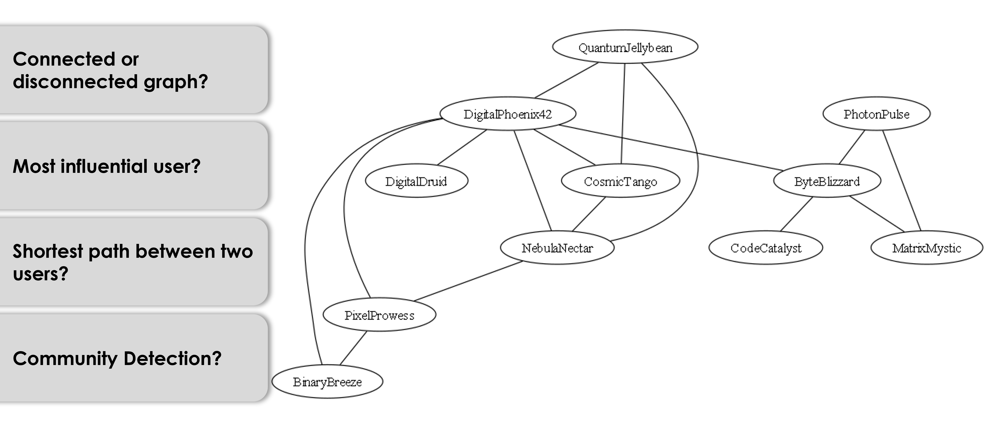

Exercise: Social Network Analysis (SNA) with Graph Theory applied to Mastodon data
==========
As part of the staff for a CS introductory course at my university, a new student assignment was conceptualized, 
implemented and added to the syllabus. Through this project a hands-on teaching approach for graph theory was achieved 
by the immediate transfer to real-world data provided by the Mastodon API. In this assigment students were asked to 
implement popular graph-traversal algorithms, like DFS and BFS, key network centrality measures, 
like edge betweenness or closeness, and community detection algorithms, like Girvan Newman algorithm. A slightly adapted version is 
published and ready to use in this repository.
  

  
   

[**Installation**](#installation)
&nbsp; &nbsp; &vert; &nbsp; &nbsp;
[Connecting to Mastodon](#connecting-to-mastodon)
&nbsp; &nbsp; &vert; &nbsp; &nbsp;
[Try coding it yourself](#try-coding-it-yourself-or)
&nbsp; &nbsp; &vert; &nbsp; &nbsp;
[Apply solution to Mastodon](#apply-solution-to-mastodon)

---

##  Installation

0. Install `python` >= 3.8.3, Install `pip` >= 20.1.1

### Using Python Virtual Environment

1. Setup a Virtual Environment
`pip3 install virtualenv && python3 -m venv sna && source sna/bin/activate`

2. Clone the repository
`git clone https://github.com/krussmann/SNA.git`

4. Change directory into the repository and Install Packages
`pip install -r requirements.txt`

## Connecting to Mastodon
To run this application, you need to

1. Sign up for a free Mastodon account at the social server here https://mastodon.social/auth/sign_up or any other Mastodon server.

2. Create a new Application within your Mastodon account with the default settings via: Preferences > Development  

3. Export the Apps access token as an environment variable called "API_key". You can either set it manually via your os settings 
or export it via the cmd: `set API_key=<access token>`. 

## Try coding it yourself or

<kbd>CLICK</kbd> here

1. Change directory to Excercise.
2. Read the task description in `sna_description.md`.
3. Implement the Graph class in `graph.py`.
4. Run the Tests provided in `graph_tests.py`.
5. Run `sna.py` which imports your implementation of the Graph class.

## Apply solution to Mastodon

<kbd>CLICK</kbd> here

0. Fetch Network of specified ID

<kbd>CLICK</kbd> for an example

  
   
  
   
  
   
  

1. Check Network Connectivity

<kbd>CLICK</kbd> for an example

  
   
  

2. Find Shortest Path between two Users

<kbd>CLICK</kbd> for an example

  
   
  

3. Identify the most influential User

   

<kbd>CLICK</kbd> for an example

  
   
  

4. Detect Communities within the Network

   

<kbd>CLICK</kbd> for an example

  
   
  
   
  

